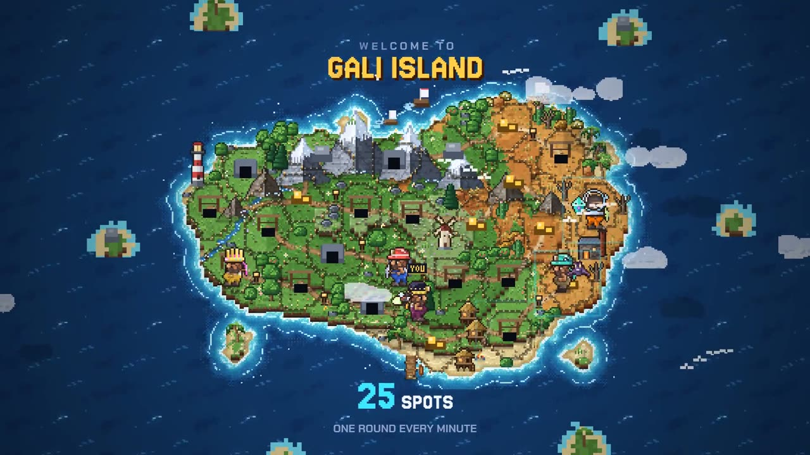

# Gali

A pixel-art mining game for Solana Seeker, played on [ORE](https://ore.supply)'s own board.

ORE runs a 25-square mining round every 200 slots (about 80 seconds). Gali draws those 25 squares as spots on a pixel island. Players put SOL on the spots they want. When their spot strikes gold they take the losing spots' SOL and mine $ORE, and 1 round in 500 two jackpots pay at once: ORE's own motherlode and Gali's SKR pool.

Built for **CLOCK IN**, the Solana Mobile hackathon. Submissions close 8 Oct 2026 (9 Oct, 14:59 GMT+8).



- **Android APK:** [install from Expo](https://expo.dev/accounts/juntdoe/projects/gali/builds/e3619d3c-c739-40ac-9ffe-503c04f7f8c3)
- **Demo video:** [YouTube](https://youtube.com/shorts/e-X-gOWoZo4)
- **Web build:** [galiapp.bounded.page](https://galiapp.bounded.page)
- **Team:** Juntdoe (lead), Josh (community), Rax (socials and creative)

## Status

Be clear about what runs today:

- **Practice mode** is the default and runs the whole game offline: the island, rounds, picking and deploying, strikes, both motherlodes, gear, quests and the chat bots. No wallet needed.
- **The Gali program** (`programs/gali`) is written for ORE's board and tested against a mock of ORE's accounts. It is not deployed yet.
- **The app's on-chain mode** has the ORE client (deploy, checkpoint, claim, automation) and the Gali calls wired, and switches on once `app/src/chain/deployment.json` names a deployed program and SKR mint.

Gali mints nothing, takes no cut of a winner's SOL and never holds a player's ORE position. ORE is credited here as the board Gali plays on; Gali is not affiliated with or endorsed by ORE.

## Repo layout

| Path | What it is |
| --- | --- |
| `programs/gali` | Anchor program: points and streaks read from ORE's rounds, the SKR jackpot, gear in SKR or ORE, staking, session keys, admin |
| `programs/ore-mock` | Test-only stand-in for ORE's program, loaded at ORE's address on a local validator |
| `tests/gali.ts` | Program tests against the mock (18 cases) |
| `app/` | Expo (React Native) app for Android and web. The island is a canvas engine in `app/src/engine` |
| `admin/` | Admin page (Vite + React): balances, token prices, settings, pools, pause, admin hand-over, players, chat moderation |
| `supabase/` | Chat server: tables plus the `chat-post` and `chat-admin` edge functions |
| `scripts/` | Pixel-art generator, devnet deploy and setup, SKR faucet, ORE layout probe, IDL generator, local test runner |
| `video/` | The 44-second intro video, rendered from the real game engine |
| `target/deploy/*.so` | Pre-built programs, so a deploy needs no Rust toolchain. The program keypair is not in git |
| `target/idl/` | Program IDLs (copied to `app/src/chain/idl.json` by `scripts/gen-idl.py`) |

## How a round works

1. **Pick.** Tap a spot to look inside, press and hold to pick it. LITE puts the same SOL on all 25 spots; PRO picks by hand, All or Smart (the least crowded spots). Shake the phone to Smart-pick.
2. **Deploy.** One transaction into ORE's board. A session key funded once lets the app deploy every round without a wallet pop-up; it can deploy but never withdraw.
3. **Strike.** ORE draws one winning square. Its miners split the losing squares' SOL (after ORE's 1% fee and 10% of the losing squares) by their SOL on the winner, and mine the round's 1 ORE. Ten squares a round are solo squares (★): on those, one miner takes the whole ORE, with odds equal to their share.
4. **Motherlode.** ORE adds 0.2 ORE to its motherlode every round and pays the whole pool 1 round in 500, split by SOL on the winning square. When it hits, Gali pays its own jackpot to the same winners, split the same way, plus 10,000 points. That jackpot is Gali's SKR pool and its ORE pool, both filled by gear sales.
5. **Record.** `record_ore_round` reads ORE's finished round and the player's miner account and awards points, wins, streaks and XP. It is permissionless, so a player who closed the app still gets credited.

Points: `40 x 25 / spots covered` for a win, times 1.25 or 1.5 with staked SKR or ORE (the better boost applies).

## The Gali program

Instructions, all in `programs/gali/src/lib.rs`:

- **Game:** `init_player`, `set_session`, `record_ore_round`, `claim_jackpot`
- **Gear:** `buy_gear` (SKR), `buy_gear_ore` (ORE). Priced in USD, converted at an admin-set rate. `motherlode_pool_bps` of an SKR sale (70% at setup) goes to the SKR jackpot pool and `ore_motherlode_bps` of an ORE sale (50% at setup) to the ORE jackpot pool; the rest goes to the treasury
- **Staking:** `stake_skr`, `unstake_skr`, `stake_ore`, `unstake_ore`
- **Pools:** `fund_motherlode` (SKR), `fund_ore` (ORE). Anyone may top up; pools have no withdraw path
- **Admin:** `init_config` (upgrade authority only), `update_config`, `set_token_prices`, `set_paused`, `withdraw_treasury`, `withdraw_treasury_ore`, `propose_authority`, `accept_authority`

ORE is built with Steel, so there is no IDL or generated client. `programs/gali/src/ore.rs` and `app/src/chain/ore/` decode ORE's accounts at offsets checked against live mainnet accounts, and refuse anything with the wrong owner, length or address. Re-run the check after ORE redeploys:

```bash
npx ts-node scripts/ore-probe.ts
```

Neither SKR nor ORE has a Pyth feed. The admin sets both rates on chain (`set_token_prices`), gear sales refuse a rate older than `price_max_age_secs`, and the app shows a live Jupiter quote beside it.

## Run it

### App (practice mode)

Needs Node 20+.

```bash
cd app
npm install --legacy-peer-deps
npx expo start --web            # or: npx expo run:android
```

Release APK: `npx eas-cli build -p android --profile apk`. Web build: `npm run build:web` writes `app/dist`, a static site.

### Program tests

Needs the Solana CLI 2.1.21 and Node 20+. Anchor is optional.

```bash
npm ci
cargo-build-sbf --manifest-path programs/gali/Cargo.toml
cargo-build-sbf --manifest-path programs/ore-mock/Cargo.toml
bash scripts/test-local.sh
```

`test-local.sh` starts a local validator with `ore-mock` at ORE's address and Gali as an upgradeable program, then runs the 18 tests. The `program` GitHub workflow does the same on every change to the programs, and the `ci` workflow type-checks and builds the app and the admin page.

### Devnet deploy

Needs the Solana CLI, Node 20+, `target/deploy/gali-keypair.json` and about 4.5 devnet SOL in `~/.config/solana/id.json`.

```bash
bash scripts/deploy-devnet.sh
ADMIN=<wallet> bash scripts/deploy-devnet.sh    # make another wallet the admin
```

It deploys or upgrades the program, creates mock SKR and ORE mints (devnet has no ORE), initialises the config and writes `app/src/chain/deployment.json`. Options: `SKR_MINT`, `ORE_MINT`, `ORE_USD`, `PRICE_MAX_AGE_SECS`, `MOTHERLODE_SEED`, `ORE_SEED`. Send test SKR with `npx ts-node scripts/faucet.ts <wallet> 50000`.

### Admin page

```bash
cd admin
cp .env.example .env            # set VITE_RPC_URL
npm install
npm run dev
```

Connect the admin wallet to make changes; any other wallet gets a read-only view. It is a static site, so `admin/dist` can go on any static host.

### Chat server (Supabase)

```bash
supabase link --project-ref <ref>
supabase db push
supabase secrets set SKR_MINT=<mint> GALI_PROGRAM_ID=GamTh2wWNNGU6CB5G3aF7Xeu1m7fQEtd9caRGtgPcMmV
supabase functions deploy chat-post --no-verify-jwt
supabase functions deploy chat-admin --no-verify-jwt
```

Then put the project URL and anon key in `app/src/chain/chat.json`. The same project carries the live map (Realtime broadcast). Messages are signed by the player's session key and checked against the on-chain Player account.

## Pixel art

Every sprite is original and drawn in code. `python3 scripts/pixel-art.py` rebuilds the island, miners, gear, pets, props and the 3x5 bitmap font into one 1024x512 atlas (`app/public/pixel/atlas.png`, `app/src/engine/art.json`).

## Known limitations

- The program is not deployed and has not run against ORE's live program, only against `ore-mock`.
- Token rates are set by the admin, not an oracle. Use a multisig as admin and a published change policy before real money.
- `init_player` grants the starter pickaxe only. The free starter helmet and outfit exist in the app but cannot be claimed on chain yet.
- It is a game of chance with real SOL. A real-money launch needs age gating and a legal review per market.

## License

MIT, see [LICENSE](LICENSE).
